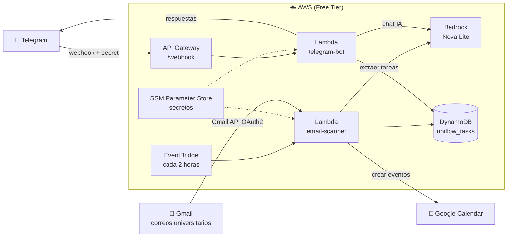

# UniFlow 🎓

> Asistente académico personal que lee tus correos universitarios, extrae tareas automáticamente, las agrega a Google Calendar y te permite consultarlas desde Telegram.
>
> 🇬🇧 *UniFlow is an AI-powered academic assistant: it reads university emails, extracts assignments with Amazon Bedrock (Nova Lite), syncs them to Google Calendar and answers questions via a Telegram bot — 100% serverless on AWS Free Tier. Built for the AWS Weekend Productivity Challenge (see [ARTICLE.md](ARTICLE.md)).*

## ¿Qué hace?

1. **Lee tu correo** — Detecta emails de tu universidad (`nikoo.barbosa@gmail.com`) cada 2 horas
2. **Extrae tareas con IA** — Usa Amazon Bedrock (Nova Lite) para identificar tareas, fechas límite y materias
3. **Sincroniza con Calendar** — Crea eventos en Google Calendar con colores por tipo y recordatorios
4. **Bot de Telegram** — Consulta tus tareas en lenguaje natural desde cualquier lugar

## Arquitectura



## Servicios AWS

| Servicio | Rol | Costo |
|---|---|---|
| **Lambda** (x2) | Email scanner + Telegram bot | Gratis (Free Tier) |
| **Bedrock Nova Lite** | Extracción de tareas + chat | ~$0 (muy bajo volumen) |
| **DynamoDB** | Base de datos de tareas | Gratis (Free Tier) |
| **EventBridge** | Trigger cada 2 horas | Gratis |
| **API Gateway** | Webhook de Telegram | Gratis (Free Tier) |
| **SSM Parameter Store** | Secretos y configuración | Gratis |

**Costo total estimado: $0/mes**

---

## Setup paso a paso

### Requisitos previos

- [x] AWS CLI configurado (`aws configure`)
- [x] Python 3.10+
- [x] Cuenta de Google con Gmail y Calendar
- [x] Cuenta de Telegram

---

### 1. Google Cloud Console

1. Ve a [console.cloud.google.com](https://console.cloud.google.com)
2. Crea un proyecto nuevo: **"UniFlow"**
3. Habilita las APIs:
   - Busca **"Gmail API"** → Habilitar
   - Busca **"Google Calendar API"** → Habilitar
4. Ve a **APIs y Servicios → Credenciales → Crear credenciales → ID de cliente OAuth 2.0**
   - Tipo de aplicación: **Aplicación de escritorio**
   - Nombre: `uniflow-client`
5. Descarga el JSON de credenciales (guárdalo, necesitas Client ID y Client Secret)
6. Ve a **Pantalla de consentimiento OAuth** → Agrega tu email como **usuario de prueba**

---

### 2. Crear bot de Telegram

1. Abre Telegram y busca **@BotFather**
2. Escribe `/newbot`
3. Sigue las instrucciones (nombre: `UniFlow`, username: `uniflow_tuapellido_bot`)
4. Copia el **token** que te da BotFather
5. Inicia una conversación con tu bot (necesario para recibir mensajes)

---

### 3. Configurar parámetros en AWS SSM

```bash
bash infra/03_create_ssm_params.sh
```

El script pedirá interactivamente:
- Google OAuth2 Client ID
- Google OAuth2 Client Secret
- Token del bot de Telegram

---

### 4. Autorizar acceso a Google (OAuth2)

```bash
pip3 install boto3
python3 setup/google_oauth_setup.py
```

El script:
1. Abre tu navegador para autorizar UniFlow
2. Solicita permisos de Gmail (solo lectura) y Calendar (escritura)
3. Guarda el refresh token en SSM automáticamente

> ⚠️ Si ya autorizaste antes y no recibes refresh_token, revoca el acceso en [myaccount.google.com/permissions](https://myaccount.google.com/permissions) y repite.

---

### 5. Deploy a AWS

```bash
bash infra/deploy.sh
```

El script ejecuta todo en orden:
1. Crea tabla DynamoDB `uniflow_tasks`
2. Crea IAM role con permisos mínimos
3. Empaqueta y despliega las 2 Lambdas
4. Crea API Gateway para el webhook de Telegram
5. Configura EventBridge (trigger cada 2 horas)
6. Registra el webhook en Telegram

---

### 6. Probar el sistema

**Forzar escaneo manual:**
```bash
aws lambda invoke \
  --function-name uniflow-email-scanner \
  --payload '{}' \
  --region us-east-1 \
  response.json && cat response.json
```

**Enviar email de prueba:**
Desde `nikoo.barbosa@gmail.com` a `nicolasbarbosagualteros@gmail.com`:
```
Asunto: Recordatorio de tareas — Semana 12

Estimados estudiantes,

Les recuerdo las siguientes actividades para esta semana:

- Cálculo III: Taller de integrales dobles — entrega el viernes 18 de julio antes de las 11:59 PM
- Programación Web: Proyecto final (avance 50%) — sustentación el lunes 21 de julio a las 2:00 PM
- Física II: Quiz sobre ondas mecánicas — jueves 17 de julio en clase

Saludos,
Coordinación Académica
```

**Verificar en DynamoDB:**
```bash
aws dynamodb scan \
  --table-name uniflow_tasks \
  --region us-east-1 \
  --query "Items[*].{Tarea: subject.S, Materia: course.S, Fecha: due_date.S, Estado: status.S}"
```

**Probar bot de Telegram:**
Abre tu bot y prueba:
- `/start` — Menú de bienvenida
- `/hoy` — Tareas de hoy
- `/semana` — Tareas de la semana
- `/tareas` — Todas las pendientes
- `/buscar cálculo` — Buscar por materia
- `/completar taller de integrales` — Marcar como completada
- `¿Cuánto tiempo tengo para el proyecto de programación?` — Chat libre con IA

**Correr los tests (no requieren AWS ni boto3):**
```bash
python3 -m unittest discover -s tests -v
```

---

## Comandos del Bot

| Comando | Descripción |
|---|---|
| `/start` o `/help` | Menú de ayuda |
| `/hoy` | Tareas que vencen hoy |
| `/semana` | Tareas de los próximos 7 días |
| `/tareas` | Todas las tareas pendientes |
| `/completar [nombre]` | Marcar tarea como completada |
| `/buscar [texto]` | Buscar por nombre o materia |
| Texto libre | Chat con IA sobre tus tareas |

---

## Estructura del proyecto

```
uniflow/
├── PLAN.md                          # Plan detallado de ejecución
├── README.md                        # Este archivo
├── infra/
│   ├── deploy.sh                    # Deploy completo (punto de entrada)
│   ├── 01_create_dynamodb.sh        # Crear tabla DynamoDB
│   ├── 02_create_iam_role.sh        # Crear IAM role
│   └── 03_create_ssm_params.sh      # Configurar secretos en SSM
├── lambdas/
│   ├── email_scanner/
│   │   ├── lambda_function.py       # Handler principal
│   │   ├── gmail_client.py          # Leer emails via Gmail API
│   │   ├── bedrock_extractor.py     # Extraer tareas con Bedrock
│   │   ├── calendar_client.py       # Crear eventos en Calendar
│   │   ├── dynamo_client.py         # CRUD DynamoDB
│   │   └── requirements.txt
│   └── telegram_bot/
│       ├── lambda_function.py       # Handler webhook Telegram
│       ├── telegram_handler.py      # Comandos y respuestas
│       ├── bedrock_chat.py          # Chat IA con contexto de tareas
│       ├── dynamo_client.py         # CRUD DynamoDB
│       └── requirements.txt
├── setup/
│   └── google_oauth_setup.py        # Autorización OAuth2 de Google
└── tests/
    ├── _helpers.py                  # boto3 falso + loader de módulos
    ├── test_extractor.py            # Parsing de respuestas de Bedrock
    ├── test_dynamo.py               # Dedup y ventanas de fecha (timezone)
    ├── test_bot.py                  # Comandos, allowlist, webhook secret
    └── sample_email.txt             # Email de ejemplo para pruebas
```

---

## Seguridad

- **Secretos en SSM Parameter Store** (`SecureString`) — nada de credenciales en el código ni en variables de entorno.
- **IAM de mínimo privilegio** — el role de las Lambdas solo puede: invocar Nova Lite, leer/escribir la tabla `uniflow_tasks`, leer parámetros `/uniflow/*` y escribir logs.
- **Webhook con secret token** — `deploy.sh` genera un secreto aleatorio y lo registra con `setWebhook`; la Lambda valida el header `X-Telegram-Bot-Api-Secret-Token` en cada request y responde 403 si no coincide.
- **Allowlist de chat (opcional)** — es un asistente personal: si creas el parámetro `/uniflow/telegram/allowed_chat_id` con tu chat ID, cualquier otro chat recibe "🔒 Este bot es privado." Tu chat ID aparece en los logs de la Lambda tras enviar `/start`.
- **Gmail en solo lectura** — el scope OAuth de Gmail es `gmail.readonly` (+ `calendar.events` para crear eventos).

## Zona horaria

Todo el sistema asume **America/Bogota (UTC-5, sin DST)**: las fechas que extrae Bedrock, los filtros de `/hoy` y `/semana`, y los eventos de Calendar. Si vives en otra zona, cambia `LOCAL_TZ` en los módulos de las Lambdas.

---

## Solución de problemas

**"No hay emails nuevos" pero sí hay emails sin leer:**
- Verifica que el remitente es exactamente `nikoo.barbosa@gmail.com`
- Revisa los logs: `aws logs tail /aws/lambda/uniflow-email-scanner --follow`

**Error de OAuth en Lambda:**
- Verifica que el refresh token está en SSM: `aws ssm get-parameter --name /uniflow/google/refresh_token --with-decryption`
- Si expiró, corre de nuevo `python3 setup/google_oauth_setup.py`

**Bot de Telegram no responde:**
- Verifica que iniciaste conversación con el bot en Telegram
- Revisa los logs: `aws logs tail /aws/lambda/uniflow-telegram-bot --follow`
- Verifica el webhook: `curl https://api.telegram.org/bot<TOKEN>/getWebhookInfo`

**Error de permisos en Bedrock:**
- Verifica que Bedrock Nova Lite está habilitado en tu región:
  `aws bedrock list-foundation-models --region us-east-1 --query "modelSummaries[?modelId=='amazon.nova-lite-v1:0']"`

---

## Tecnologías usadas

- **Python 3.12** — Runtime de Lambda
- **Amazon Bedrock** (Nova Lite) — IA para extracción y chat
- **AWS Lambda** — Serverless compute
- **Amazon DynamoDB** — Base de datos NoSQL
- **Amazon EventBridge** — Scheduler
- **Amazon API Gateway** — Webhook HTTP
- **AWS SSM Parameter Store** — Gestión de secretos
- **Gmail API** — Lectura de correos
- **Google Calendar API** — Gestión de eventos
- **Telegram Bot API** — Interfaz de usuario

---

*Construido para el AWS Build a Productivity App Weekend Challenge 🏆*
