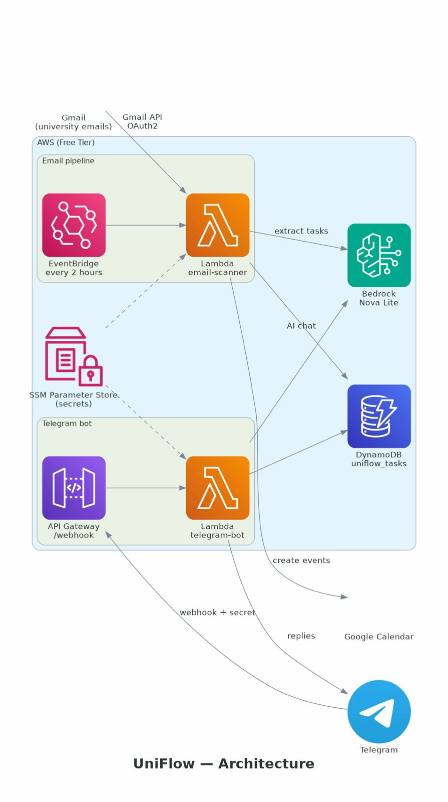

# UniFlow

AI-powered academic assistant: it reads university emails, extracts assignments with Amazon Bedrock (Nova Lite), creates the corresponding Google Calendar events, and answers questions about pending work through a Telegram bot. The system runs entirely serverless on AWS and fits within the Free Tier.

Built for the AWS Build a Productivity App Weekend Challenge. The full write-up is in [ARTICLE.md](ARTICLE.md).

## How it works

1. **Email scanning.** Every two hours, an EventBridge rule triggers the `email-scanner` Lambda, which reads new emails from the configured university sender through the Gmail API (OAuth 2.0, read-only scope).
2. **AI extraction.** Each email body is sent to Amazon Bedrock (Nova Lite), which returns structured JSON: task name, course, due date, type and priority. Relative dates ("next Friday") are resolved against the email's date.
3. **Calendar sync.** Each new task becomes a color-coded Google Calendar event with reminders scaled to its priority.
4. **Telegram bot.** The `telegram-bot` Lambda, behind an API Gateway webhook, answers commands and free-text questions about pending tasks, using Nova Lite with the real task list as context.

## Architecture



| Service | Role |
|---|---|
| AWS Lambda (x2, Python 3.12) | `uniflow-email-scanner` and `uniflow-telegram-bot` |
| Amazon Bedrock (Nova Lite) | Task extraction and natural-language chat |
| Amazon DynamoDB | `uniflow_tasks` table, GSI on `status`/`due_date` |
| Amazon EventBridge | Scanner schedule (every 2 hours) |
| Amazon API Gateway | HTTPS webhook for Telegram |
| AWS SSM Parameter Store | Secrets and configuration (SecureString) |

Estimated running cost: $0/month at personal volume (AWS Free Tier; Bedrock usage is negligible).

## Bot commands

| Command | Description |
|---|---|
| `/start`, `/help` | Help menu |
| `/hoy` | Tasks due today |
| `/semana` | Tasks due in the next 7 days |
| `/tareas` | All pending tasks |
| `/completar [name or id]` | Mark a task as completed and delete its calendar event |
| `/buscar [text]` | Search by task name or course |
| Free text | AI chat about your tasks |

Commands and replies are in Spanish (it is a personal assistant); adapt `lambdas/telegram_bot/telegram_handler.py` for other languages.

## Project structure

```
uniflow/
├── infra/
│   ├── deploy.sh                 # Full deployment (entry point)
│   ├── 01_create_dynamodb.sh     # DynamoDB table + GSI
│   ├── 02_create_iam_role.sh     # Least-privilege IAM role
│   └── 03_create_ssm_params.sh   # SSM parameters and secrets
├── lambdas/
│   ├── email_scanner/            # Gmail -> Bedrock -> DynamoDB + Calendar
│   └── telegram_bot/             # Webhook -> commands + AI chat
├── setup/
│   └── google_oauth_setup.py     # One-time Google OAuth authorization
├── tests/                        # Unit tests (run without AWS)
└── ARTICLE.md                    # Challenge article
```

## Setup

### Prerequisites

- AWS CLI configured, with Amazon Bedrock Nova Lite available in `us-east-1`
- Python 3.10+
- A Google account (Gmail and Calendar)
- A Telegram account

### 1. Google Cloud credentials

In [console.cloud.google.com](https://console.cloud.google.com): create a project, enable the **Gmail API** and **Google Calendar API**, create an **OAuth 2.0 client ID** (application type: Desktop), and add your email as a test user on the OAuth consent screen. Keep the client ID and client secret.

### 2. Telegram bot

Create a bot with **@BotFather** (`/newbot`) and keep the token. Start a conversation with your bot so it can message you.

### 3. Configuration and secrets

Edit the two email addresses at the top of `infra/03_create_ssm_params.sh` (the university sender and your own email), then run:

```bash
bash infra/03_create_ssm_params.sh
```

The script prompts for the Google client ID/secret and the Telegram token and stores everything in SSM Parameter Store.

### 4. Google authorization

```bash
pip3 install boto3
python3 setup/google_oauth_setup.py
```

This opens the browser, requests Gmail (read-only) and Calendar permissions, and stores the refresh token in SSM. If Google does not return a refresh token, revoke the app's access at [myaccount.google.com/permissions](https://myaccount.google.com/permissions) and run it again.

### 5. Deploy

```bash
bash infra/deploy.sh
```

Idempotent: creates the DynamoDB table, the IAM role, both Lambdas, the API Gateway webhook, the EventBridge schedule, and registers the Telegram webhook with a generated secret token.

### 6. Verify

```bash
# Force a manual scan
aws lambda invoke --function-name uniflow-email-scanner \
  --payload '{}' --region us-east-1 response.json && cat response.json

# Inspect extracted tasks
aws dynamodb scan --table-name uniflow_tasks --region us-east-1 \
  --query "Items[*].{Task: subject.S, Course: course.S, Due: due_date.S, Status: status.S}"
```

Then send `/start` to your bot on Telegram.

## Testing

```bash
python3 -m unittest discover -s tests -v
```

48 unit tests covering Bedrock response parsing, deduplication, timezone windows, webhook validation and bot command dispatch. They inject a fake `boto3`, so they run without AWS credentials or any dependencies installed.

## Security

- All secrets (Google OAuth credentials, refresh token, Telegram token, webhook secret) are `SecureString` parameters in SSM Parameter Store — never in code or environment variables.
- The Gmail OAuth scope is `gmail.readonly`: the app cannot modify, delete or send mail. Calendar uses `calendar.events`.
- The Lambda IAM role is least-privilege: it can invoke one model, access one table, read one parameter prefix, and write its own logs.
- The Telegram webhook validates the `X-Telegram-Bot-Api-Secret-Token` header on every request; an optional allowlist (`/uniflow/telegram/allowed_chat_id`) restricts the bot to its owner.
- DynamoDB stores only extracted task fields plus the source email's ID and subject; full email bodies are never persisted.

## Timezone

The system assumes **America/Bogota (UTC-5, no DST)** for extracted dates, the today/week query windows and calendar events. Change `LOCAL_TZ` in the Lambda modules for other timezones.

## Troubleshooting

- **"No new emails" but unread emails exist** — confirm the sender address matches the SSM parameter `/uniflow/config/sender_email`; check `aws logs tail /aws/lambda/uniflow-email-scanner --follow`.
- **OAuth errors in Lambda** — verify the refresh token exists (`aws ssm get-parameter --name /uniflow/google/refresh_token --with-decryption`); if it expired, re-run `python3 setup/google_oauth_setup.py`.
- **Bot not answering** — confirm you started a conversation with the bot; inspect the webhook with `curl https://api.telegram.org/bot<TOKEN>/getWebhookInfo`; check `aws logs tail /aws/lambda/uniflow-telegram-bot --follow`.
- **Bedrock permission errors** — confirm Nova Lite is available: `aws bedrock list-foundation-models --region us-east-1 --query "modelSummaries[?modelId=='amazon.nova-lite-v1:0']"`.
